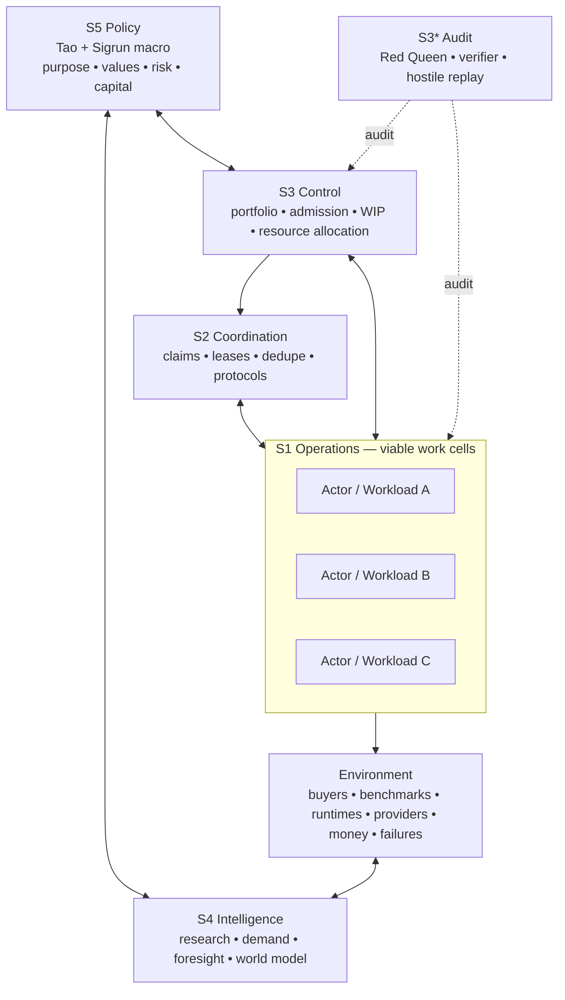
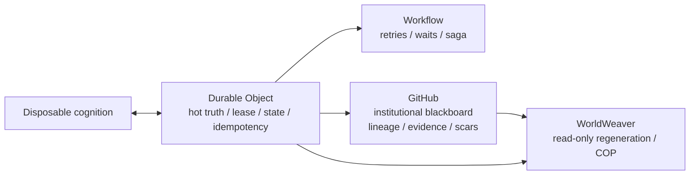
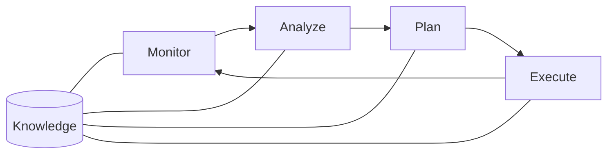
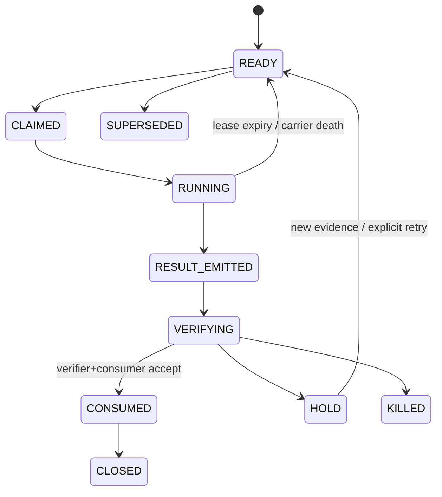
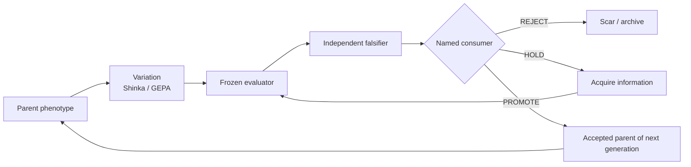

# GEN140 Grimoire — Public Canonical Swarm Engineering Specification

**Spec ID:** `GEN140_GRIMOIRE_V1`  
**Status:** `PUBLIC_ARCHITECTURE_BASELINE__NO_EFFECT_AUTHORITY`  
**Observed UTC:** `2026-09-13T15:25:04Z`

This is the public architecture/memory anchor for GEN140/GEN141-candidate work. It exists to stop repeated architecture rediscovery and to give fresh carriers a stable COTS-first composition to **falsify or simplify**, not reinvent.

## Memory guard

```text
CANONICAL_SPEC > CHAT_RECOLLECTION > MODEL_MEMORY
REDISCOVERED_CANON != ARCHITECTURE_DELTA
COTS_EXISTS -> USE_DIRECTLY -> THIN ADAPTER -> ASSAY
NEW_ABSTRACTION_REQUIRES_EXACT_GAP_RECEIPT
RESULT_EXISTS != RESULT_CONSUMED
HEARTBEAT != USEFUL_WORK
ACTOR != ROLE != CARRIER != AUTHORITY
UNKNOWN != GREEN
```

If a carrier independently derives VSM, MAPE-K, mission command, stigmergy, holons/PROSA, COTS-first ownership, or Result→Consumer closure without new evidence, classify it as `REDISCOVERY_NO_DELTA` and continue current work. Repetition is a memory/bootstrap defect, not independent architectural novelty.

## Mission

Build a **recursive cybernetic mission-command ecology** in which Tao and Sigrun handle macro intent while autonomous work cells handle bounded micro execution.

```text
Tao + Sigrun: purpose / end-state / priorities / constraints / capital / risk
Swarm:         claim / act / verify / consume / learn / reproduce
```

North-star fitness:

```text
verified useful external transitions
------------------------------------
Tao routine touches + cash + custom control semantics + coordination tax
```

## Framework composition

| Concern | Adopted framework | GEN140 use |
|---|---|---|
| Macro delegation | Mission Command | intent + end-state + constraints; decentralized means |
| Recursive organization | Viable System Model (VSM) | S1–S5 recursive viability |
| Work-cell autonomics | MAPE-K | Monitor → Analyze → Plan → Execute over Knowledge |
| Agent commitment | BDI | explicit beliefs/desires/intentions |
| Partial observability | POMDP / hierarchical POMDP discipline | belief states + value-of-information, locally |
| Indirect coordination | Stigmergy + Blackboard | typed durable traces drive later action |
| Autonomous units | Holonic systems / PROSA | Order/Product/Resource/Staff holons |
| Problem modes | Cynefin | automate/analyze/probe/contain by context |
| Problem solving | Polya + A3 + Toyota Kata/PDSA | current → target → obstacle → experiment → look back |
| Bottleneck control | Theory of Constraints + WIP | exploit current constraint before adding capacity |
| Build vs buy | Wardley Mapping | consume commodity/COTS; do not rebuild |
| Durable history | Event Sourcing + CQRS concepts | immutable receipts + separate read projections |
| Long-running work | Saga / Process Manager | workflow owns retries/waits/compensation |
| Improvement | Evolution / QD / MOME | variation → evaluation → falsification → selection → reproduction |

## VSM recursion



Always state recursion level before solving:

```text
R0 operator/life viability
R1 HFO research organization
R2 Sigrun actor ecology
R3 campaign / mission
R4 Workload
R5 actor MAPE-K cycle
```

## COTS ownership map

Default ownership stands until a receipt proves a gap.

| Capability | Native/COTS owner |
|---|---|
| Durable actor identity + hot state | Cloudflare Agents SDK + Durable Objects + SQLite |
| Durable retries/waits/process | Cloudflare Workflows / AgentWorkflow |
| Backpressure/buffering | Cloudflare Queues only when measured need appears |
| Private in-platform calls | Service Bindings / Workers RPC |
| Model credentials/routing/rate/budget | Cloudflare AI Gateway + BYOK + Dynamic Routes |
| Cognition | replaceable admitted model providers |
| External deterministic compute | admitted native VPS/local services or pull consumers |
| Program evolution | ShinkaEvolve |
| Text/Skill/policy evolution | GEPA |
| QD/MOME archive | pyribs when diversity need is proven |
| Adversarial/eval harness | Promptfoo where useful |
| Exact fitness | frozen domain-native evaluator |
| Identity/discovery | A2A Agent Card |
| LLM capabilities | Agent Skills + progressive disclosure |
| Shared dynamic tools | MCP only when a real shared discovery boundary exists |
| Institutional evidence/lineage | GitHub |
| Public regeneration | WorldWeaver |

**Ablation law:** deletion is free. Additions must delete owned semantics or demonstrate a native gap.

## State and memory ownership

```text
HOT WORLD STATE       -> Durable Object / SQLite
LONG-RUN PROCESS      -> Workflow / Process Manager
INSTITUTIONAL MEMORY  -> GitHub receipts, scars, ResultRecords, reviewed specs
PUBLIC REGENERATION   -> WorldWeaver read-only projection
ARTIFACT TRUTH        -> immutable hashes / source refs
EPISODIC COGNITION    -> disposable model context
```



GitHub is a durable stigmergic blackboard, not the sole hot lock/lease system. WorldWeaver is a projection, not authority. Model memory is a cache, not state.

## 5W1H Workload contract

```yaml
schema: HFO_WORKLOAD_V1
grimoire_spec_id: GEN140_GRIMOIRE_V1
mission_ref:
workload_id:
WHAT:
  target_observable_transition:
WHY:
  protected_objective:
  fitness_dimensions: []
WHO:
  actor_class:
  verifier:
  consumer:
  effect_authority:
WHERE:
  hot_state_ref:
  artifact_refs: []
  evidence_surface:
WHEN:
  queued_utc:
  deadline_utc:
  lease_ttl:
  retry_budget:
  escalation_condition:
HOW:
  candidate_mechanism:
  evaluator_ref:
  success_gate:
  kill_gate:
  recovery_path:
CURRENT_STATE:
TARGET_STATE:
UNCERTAINTIES: []
EFFECT_BUDGET:
NEXT_CONSUMER:
TAO_RELAY_REQUIRED: false
```

Mission orders carry intent and boundaries, not giant prompt procedures.

## Actor kernel — MAPE-K + Polya + BDI



- **Monitor:** authoritative state, lease, receipts, signals, spec, artifact IDs.
- **Analyze:** Cynefin class, uncertainty, TOC bottleneck, collision/staleness, evidence vs inference.
- **Plan:** Polya/A3/Kata; current/target → obstacle → analogy/COTS → cheapest discriminating experiment → success/kill gates.
- **Execute:** one admitted bounded step; no adjacent speculative redesign.
- **Look back:** scars, capability fitness, beliefs, exact next consumer.

BDI minimum:

```yaml
beliefs:
  facts: []
  uncertain: []
desires:
  - satisfy_workload
  - preserve_constraints
  - reduce_tao_touch
intention:
  workload_ref:
  committed_plan:
  terminates_on: [success, falsification, lease_expiry, supersession, material_state_change]
```

## HPOMDP discipline

Do not solve one global exact POMDP. Use local hierarchical belief-state reasoning where uncertainty changes the next action.

```text
utility(action) ≈ expected useful transition
                  + value of information
                  - cash
                  - operator minutes
                  - compute
                  - risk
                  - coordination tax
```

`UNKNOWN` remains first-class.

## Holonic / PROSA mapping

| Holon | GEN140 mapping |
|---|---|
| Order | Mission / Workload |
| Product | artifact / candidate / ResultRecord lineage |
| Resource | model, runtime, compute, tool, provider |
| Staff | Sigrun, researcher, reducer, verifier, policy/evolution support |

A work cell is a temporary coalition of holons around one Workload. Capability does not imply authority.

## Stigmergy event vocabulary

```text
WORK_READY
CLAIM_ACQUIRED / CLAIM_EXPIRED
MATERIAL_CHECKPOINT
RESULT_EMITTED
VERIFICATION_PASS / FAIL / HOLD
CONSUMER_ACK
TRANSITION_REQUESTED
EFFECT_RECEIPT
WORK_CLOSED / KILLED / SUPERSEDED
SCAR_ADMITTED
```

Heartbeat is liveness only.

Cold carriers resume lineage with a **fresh carrier UUID** and parent references. They never impersonate a dead carrier.

## Work / Result lifecycle



```text
CANDIDATE
 -> EVALUATED
 -> INDEPENDENTLY_VERIFIED
 -> CONSUMER_ACKED
 -> PROMOTED | REJECTED | HELD
```

The same immutable Result may cause zero second accepted effect.

## Reproduction membrane



Promotion requires applicable gates:

```text
immutable candidate identity
+ frozen evaluator identity
+ independent verification
+ consumer ACK
+ source/runtime binding when execution matters
+ policy/effect admission
```

Producer cannot self-promote. Model vote is not truth. Result storage is not consumption.

## Cynefin routing

| Context | Behavior |
|---|---|
| Clear | deterministic SOP/tool; automate |
| Complicated | expert analysis + frozen evaluator |
| Complex | bounded safe-to-fail probes; reduce from external signals |
| Chaotic | contain effects/spend/security first |
| Confused | decompose/classify before dispatch |

## Mission-command macro interface

```yaml
MISSION:
PURPOSE:
END_STATE:
PRIORITIES: []
CONSTRAINTS: []
FITNESS_DIMENSIONS: []
RISK_BUDGET:
CASH_BUDGET:
DECISION_RIGHTS:
REVIEW_CADENCE:
```

Sigrun turns this into Workloads, WIP limits, experiments, reducers, and exceptions. Tao is strategy/capital/effect authority, not routine scheduler/router/context courier.

## Anti-sprawl law

Before adding a scheduler, queue, state store, registry, router, runtime, tool bus, evaluator, telemetry system, or ontology:

1. name current native owner;
2. run smallest COTS assay;
3. record exact failure;
4. prove thin adapter cannot close it;
5. name semantics added and deleted;
6. require independent admission.

```text
NEW_COMPONENT + 0_DELETED_SEMANTICS = DEFAULT_HOLD
COTS_WRAPPER_THAT_REIMPLEMENTS_COTS = KILL
ARCHITECTURE_NOVELTY_WITHOUT_FAILURE_RECEIPT = UNTRUSTED
```

## Architecture memory protocol

Never conflate:

```text
GRIMOIRE = stable architecture / doctrine / invariants
WORLD_STATE = current actors / workloads / blockers / receipts
HERITAGE = historical lessons / scars / superseded alternatives
```

Every architecture-capable carrier reports:

```yaml
GRIMOIRE_READ:
  spec_id:
  source_ref:
ARCHITECTURE_DELTA: NONE | PROPOSED
REDISCOVERY_NO_DELTA: true | false
```

Repeated rediscovery of the canonical architecture is a bootstrap/memory-system failure, not consensus.

## Acceptance ladder

### R0 operational recursion

```text
Goal
-> durable actor
-> admitted cognition/tool
-> bounded work
-> durable Result
-> frozen evaluation
-> independent verification
-> named ConsumerAck
-> exactly-one next transition
```

Kill transient cognition and recover without Tao context ferry.

### R1 three-generation reproduction

Inject carrier death, duplicate/stale results, bad metadata, provider failure, and source/runtime mismatch.

PASS:

```text
Tao routine touches = 0 after admission
accepted duplicate effects = 0
unconsumed terminal results = 0
unknown parentage = 0
evaluator mutation = 0
N+1 causally derives from accepted N
```

### R2 domain transfer

Run the same control plane on an unrelated domain without a new scheduler/router/state store/actor runtime/evolution framework.

### R3 meta-improvement

Only after R0–R2 may the system propose changes to its own control policies/components. Self-modification cannot mutate its own judge in the same episode.

## North stars

```text
FAN_OUT_IS_NOT_PROGRESS_UNTIL_FAN_IN
AVAILABLE_COMPUTE != WORK_DEMAND
USED_COMPUTE != USEFUL_WORK
USEFUL_WORK != ACCEPTED_WORK
CHECKPOINTED != CONSUMED
SELF_REPORTED_FITNESS = 0
RECOMMENDATION_BEFORE_FALSIFICATION = UNTRUSTED
BUILDABILITY != DEMAND
EXTERNAL_WORLD_SUPPLIES_FINAL_FITNESS
```

When a fresh carrier receives only **“recover GEN140”** or **“regenerate Sigrun”**:

1. read this Grimoire;
2. read current durable world state;
3. identify recursion level and current bottleneck;
4. resume lineage with a fresh carrier UUID;
5. prefer fan-in/falsification/consumption/closure over new architecture;
6. propose architecture changes only with an exact gap receipt.

**The architecture is now a baseline to falsify, simplify, and evolve under evidence — not something to rediscover every few days.**
